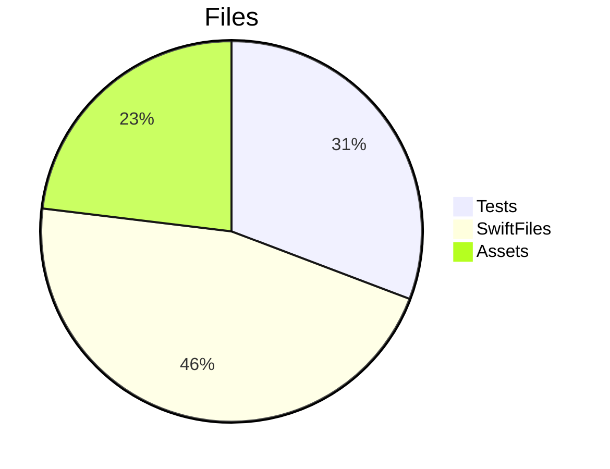
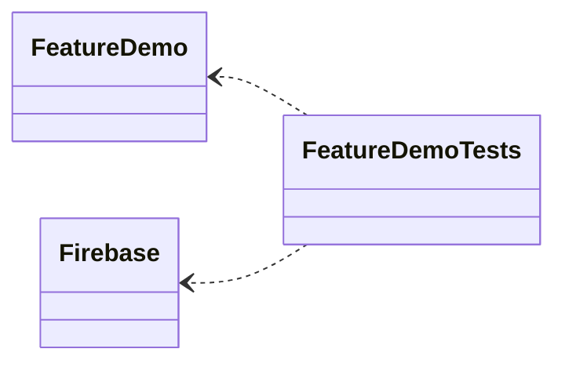

# Swift-Plugin-Resources
A swift package plugin that automatically generates Swift code for package asset resources


# How to use 


Package.swift based SPM project
Add a dependency in Package.swift:
```swift
dependencies: [
    .package(url: "https://github.com/MedNouri/Swift-Plugin-Resources", branch: "main")
]

```
For the related target, Add

```swift
 .target(
    name: "FeatureDemo",
    plugins: [
       .plugin(name: "AssetResources", package: "SwiftPluginResources")
     ]
   )
```


# Generate Package Metadata
A swift package plugin that automatically generates package Metadata as:
- Package Base Informations
- Package Contributors
- Base pakcage file Statistics
- Dependencies Table 
- Products ClassDiagram (mermaid)
- DependeciesUsageGraph (mermaid)

# How to use 

```
For the related target, Add

```swift
 .target(
    name: "FeatureDemo",
    plugins: [
       .plugin(name: "GeneratePackageMetadata", package: "SwiftPluginResources")
     ]
   )
```

# Example:

# Package: FeatureDemo 📦
-  Last changed date: *20/03/2023*
-  ToolsVersion: *ToolsVersion(major: 5, minor: 7, patch: 0)*
-  Origin: *root*
-  Directory: *FeatureDemo*
-  Dependencies Count: *2*
-  Products Count: *2*
-  Targets Count: *3*


## Contributors 

| Number of Commits | Committer | Last Commit Date |
|------|-----------|-----------------|
|20| Mohamed Nouri| 20/03/2023

## Package Structure

| File Type | Sum |
|-------|------------|
| Files |**10**|
| Swift files |4|
| Tests |4|
| Assets |3|


## Package Dependencies:

| Index | Dependency | Origin |
|-------|------------|--------|
|  1  |  Firebase  | root  |
|  2  |  SwiftPluginResources  | root  |

## Dependency Graph 


 


